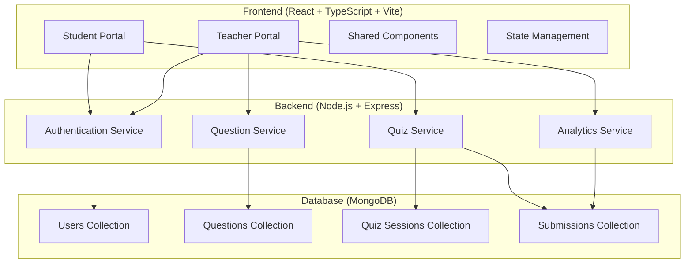

# Design Document

## Overview

多学生共同答题系统采用前后端分离架构，前端使用React 18 + TypeScript + Vite构建响应式Web应用，后端使用Node.js + Express提供RESTful API服务，数据存储使用MongoDB。系统支持教师创建管理题目、学生在线答题、实时结果反馈和统计分析功能。

## Architecture

### System Architecture



### Technology Stack

**Frontend:**
- React 18 with TypeScript for type safety
- Vite for fast development and building
- React Router for client-side routing
- Axios for HTTP requests
- Tailwind CSS for responsive styling
- React Hook Form for form management
- Zustand for state management

**Backend:**
- Node.js with Express framework
- TypeScript for type safety
- JWT for authentication
- Mongoose for MongoDB ODM
- Cors for cross-origin requests
- Helmet for security headers
- Rate limiting for API protection

**Database:**
- MongoDB for document storage
- Indexes for query optimization

## Components and Interfaces

### Frontend Components

#### Student Portal Components
```typescript
// Student Dashboard
interface StudentDashboard {
  availableQuizzes: Quiz[]
  completedQuizzes: QuizResult[]
  onStartQuiz: (quizId: string) => void
}

// Quiz Taking Interface
interface QuizInterface {
  quiz: Quiz
  currentQuestion: number
  selectedAnswers: Record<string, string>
  onAnswerSelect: (questionId: string, answer: string) => void
  onSubmit: () => void
}

// Results Display
interface ResultsDisplay {
  result: QuizResult
  quiz: Quiz
  onReturnToDashboard: () => void
}
```

#### Teacher Portal Components
```typescript
// Question Management
interface QuestionManager {
  questions: Question[]
  onCreateQuestion: (question: CreateQuestionDto) => void
  onEditQuestion: (id: string, question: UpdateQuestionDto) => void
  onDeleteQuestion: (id: string) => void
}

// Analytics Dashboard
interface AnalyticsDashboard {
  quizStats: QuizStatistics[]
  studentPerformance: StudentPerformance[]
  filters: AnalyticsFilters
  onFilterChange: (filters: AnalyticsFilters) => void
}
```

#### Shared Components
```typescript
// Responsive Layout
interface ResponsiveLayout {
  children: React.ReactNode
  sidebar?: React.ReactNode
  isMobile: boolean
}

// Loading States
interface LoadingSpinner {
  size?: 'small' | 'medium' | 'large'
  message?: string
}
```

### Backend API Interfaces

#### Authentication Endpoints
```typescript
POST /api/auth/login
POST /api/auth/register
POST /api/auth/refresh
POST /api/auth/logout
```

#### Question Management Endpoints
```typescript
GET /api/questions - 获取题目列表
POST /api/questions - 创建新题目
PUT /api/questions/:id - 更新题目
DELETE /api/questions/:id - 删除题目
```

#### Quiz Endpoints
```typescript
GET /api/quizzes - 获取可用测验
POST /api/quizzes/:id/start - 开始答题
POST /api/quizzes/:id/submit - 提交答案
GET /api/quizzes/:id/result - 获取结果
```

#### Analytics Endpoints
```typescript
GET /api/analytics/overview - 总体统计
GET /api/analytics/questions/:id - 单题统计
GET /api/analytics/students - 学生表现
GET /api/analytics/export - 导出数据
```

## Data Models

### User Model
```typescript
interface User {
  _id: ObjectId
  username: string
  email: string
  password: string // hashed
  role: 'teacher' | 'student'
  profile: {
    firstName: string
    lastName: string
    avatar?: string
  }
  createdAt: Date
  updatedAt: Date
}
```

### Question Model
```typescript
interface Question {
  _id: ObjectId
  title: string
  content: string
  options: {
    id: string
    text: string
  }[]
  correctAnswer: string
  explanation?: string
  difficulty: 'easy' | 'medium' | 'hard'
  tags: string[]
  createdBy: ObjectId // Teacher ID
  createdAt: Date
  updatedAt: Date
}
```

### Quiz Session Model
```typescript
interface QuizSession {
  _id: ObjectId
  title: string
  description?: string
  questions: ObjectId[] // Question IDs
  timeLimit?: number // minutes
  isActive: boolean
  createdBy: ObjectId // Teacher ID
  createdAt: Date
  updatedAt: Date
}
```

### Submission Model
```typescript
interface Submission {
  _id: ObjectId
  quizId: ObjectId
  studentId: ObjectId
  answers: {
    questionId: ObjectId
    selectedAnswer: string
    isCorrect: boolean
  }[]
  score: number
  totalQuestions: number
  startTime: Date
  submitTime: Date
  timeSpent: number // seconds
}
```

## Error Handling

### Frontend Error Handling
```typescript
// Global Error Boundary
class ErrorBoundary extends React.Component {
  // Handle React component errors
}

// API Error Handling
interface ApiError {
  status: number
  message: string
  code?: string
}

// Toast Notifications for user feedback
interface ToastService {
  success: (message: string) => void
  error: (message: string) => void
  warning: (message: string) => void
}
```

### Backend Error Handling
```typescript
// Centralized Error Handler
interface ApiResponse<T> {
  success: boolean
  data?: T
  error?: {
    message: string
    code: string
    details?: any
  }
}

// Common Error Types
enum ErrorCodes {
  VALIDATION_ERROR = 'VALIDATION_ERROR',
  AUTHENTICATION_ERROR = 'AUTHENTICATION_ERROR',
  AUTHORIZATION_ERROR = 'AUTHORIZATION_ERROR',
  NOT_FOUND = 'NOT_FOUND',
  INTERNAL_ERROR = 'INTERNAL_ERROR'
}
```

## Testing Strategy

### Frontend Testing
- **Unit Tests**: React Testing Library for component testing
- **Integration Tests**: API integration with mock services
- **E2E Tests**: Cypress for critical user flows
- **Accessibility Tests**: axe-core for a11y compliance

### Backend Testing
- **Unit Tests**: Jest for service and utility functions
- **Integration Tests**: Supertest for API endpoint testing
- **Database Tests**: MongoDB Memory Server for isolated testing

### Mobile Testing
- **Responsive Testing**: Browser dev tools and real devices
- **Touch Interaction Testing**: Manual testing on tablets and phones
- **Performance Testing**: Lighthouse for mobile performance metrics

## Security Considerations

### Authentication & Authorization
- JWT tokens with refresh mechanism
- Role-based access control (RBAC)
- Password hashing with bcrypt
- Rate limiting on authentication endpoints

### Data Protection
- Input validation and sanitization
- SQL injection prevention (NoSQL injection for MongoDB)
- XSS protection with Content Security Policy
- HTTPS enforcement in production

### API Security
- CORS configuration for allowed origins
- Request size limits
- API rate limiting
- Security headers with Helmet.js

## Performance Optimization

### Frontend Optimization
- Code splitting with React.lazy()
- Image optimization and lazy loading
- Memoization for expensive calculations
- Virtual scrolling for large lists
- Service Worker for caching

### Backend Optimization
- Database indexing for frequent queries
- Connection pooling for MongoDB
- Response caching for static data
- Compression middleware
- Query optimization

### Mobile Performance
- Responsive images with srcset
- Touch-friendly UI elements (44px minimum)
- Reduced bundle size for mobile networks
- Progressive Web App features